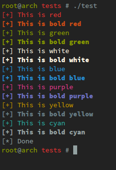
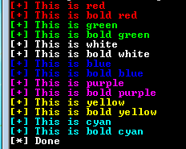

# color_shell
color_shell is a simple multi-platform C library that helps you to write some
colored text into a terminal. It's been tested on GNU/linux and Windows 7 for now;
here are some screenshots :

Here's how it renders on my linux box:



and on Windows 7:




Here's the list of provided functions:

```C
void w_red(char *fmt, ...);
void w_bred(char *fmt, ...);
void w_green(char *fmt, ...);
void w_bgreen(char *fmt, ...);
void w_white(char *fmt, ...);
void w_bwhite(char *fmt, ...);
void w_blue(char *fmt, ...);
void w_bblue(char *fmt, ...);
void w_purple(char *fmt, ...);
void w_bpurple(char *fmt, ...);
void w_yellow(char *fmt, ...);
void w_byellow(char *fmt, ...);
void w_cyan(char *fmt, ...);
void w_bcyan(char *fmt, ...);
void w_rewind(void);
```

Note: The `b` prefix stands for `bold`.
